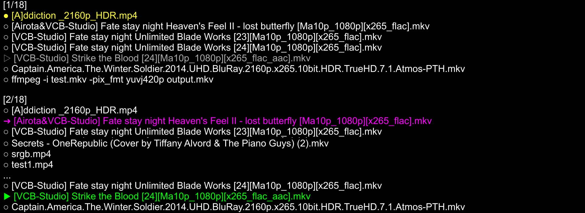

# mpv播放器折腾记录

_从萌新到大白，<s>用前嫌麻烦</s> 用后真香_  
[命令行播放器 mpv](https://github.com/mpv-player/mpv) 的个人设置备份（windows10/11）

前往上方的 **[📖维基版块📖](https://github.com/hooke007/MPV_lazy/wiki)** 查看关于子目录中各文件的说明

建议直接下载本仓库内的原档文件进行修改，如果自行新建文本编辑，注意编码格式应为 **UTF-8** ，换行符为 **LF** ，否则mpv可能无法识别  

从零开始接触mpv且不使用懒人包的话可参考
- [win10/11 mpv播放器通用教程](https://hooke007.github.io/unofficial/mpv_start.html)  
- [其它mpv相关的中文文档](https://github.com/hooke007/mpv_doc-CN)

## 懒人包 mpv-lazy

懒人包是解压即可使用的完整解决方案 [快速说明](https://hooke007.github.io/mpv-lazy/[00]_懒人包快速说明.html)  
系列说明文档列表 [我的主页#系列手册](https://hooke007.github.io/index2#系列手册)  
下载见 [**Releases**](../../releases)

## 简易包 mpv.net_CM

简易包是基于mpv.net（一个基于libmpv的前端程序）的中文修改版，更加易于上手。除了涵盖了懒人包的大部分选项外，还实现了一些额外的实用功能与合格的图形交互，更像一个普通人使用的播放器。  
传送门 [mpv.net_CM](https://github.com/hooke007/mpv.net_CM)

## 预览

