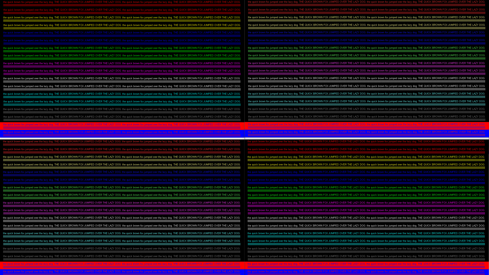
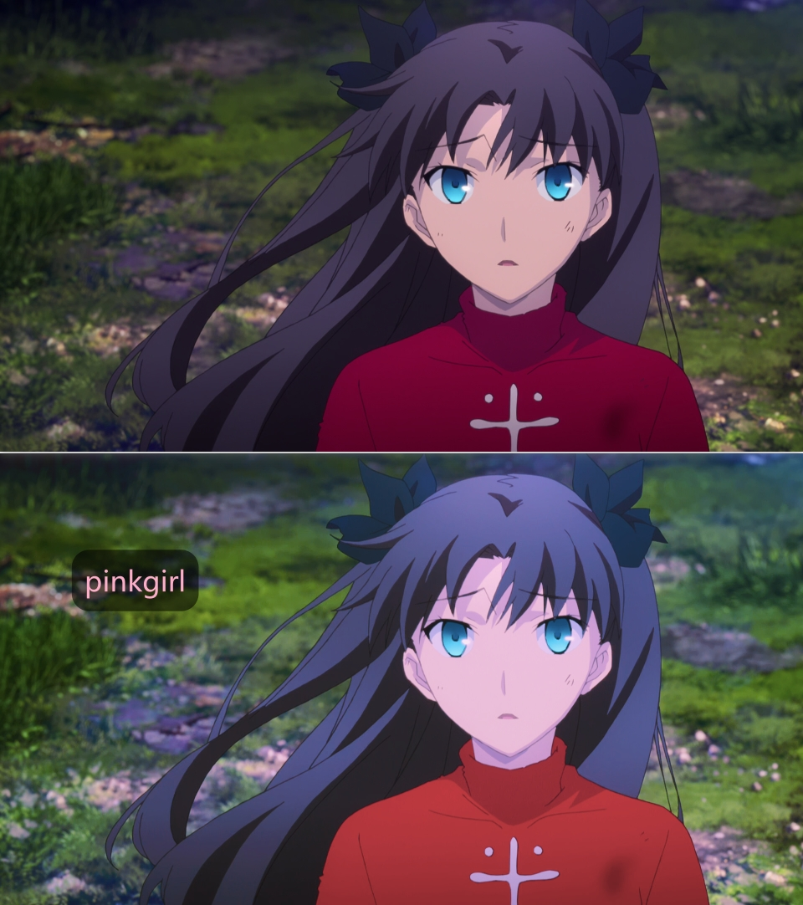
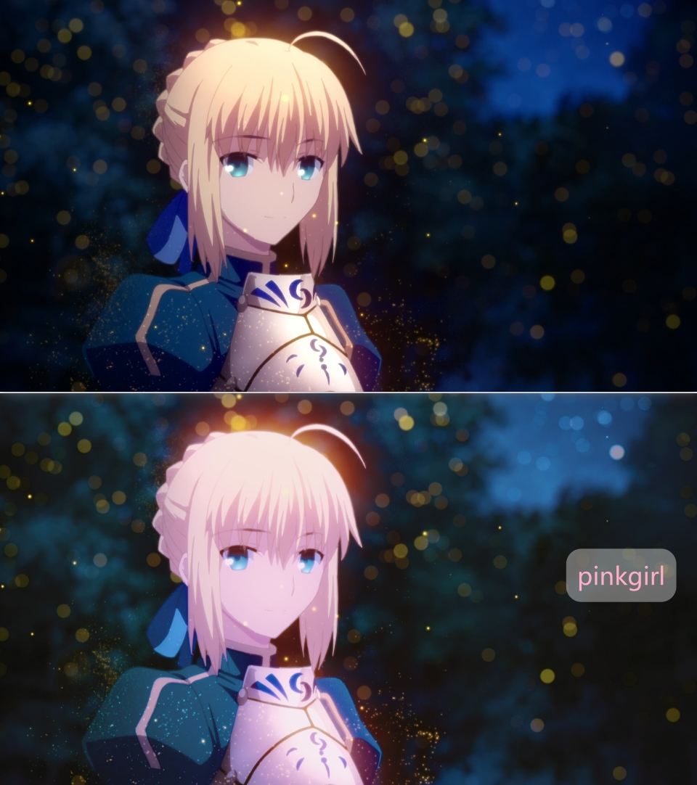

# 杂物

## CSCALE（色度升频）算法的对比

一般视频看不出来？正常，首先人眼对亮度平面的敏感度远高于色度平面；其次，因为你没有特殊的母源作为参考。  
[chroma-444.png](chroma-444.png) 当基准， [chroma-420.jpg](chroma-420.jpg) 是经过预处理的色度半采样成品，分别打开多个mpv空窗口，分别拖入进行对比。

在开始比较前，需要做以下准备：  
- 在 **mpv.conf** 中设置 `image-display-duration=inf` 防止1秒读图后自动关闭
- 在 **input.conf** 中添加以下这行代码，就可以在运行时使用快捷键快速切换色度升频的算法，即时观看差异。  
`Ctrl+c   cycle-values cscale "bilinear" "spline36" "sinc" "lanczos" "jinc" "bicubic" "catmull_rom"`  
不嫌烦的话，也可以在运行时调出控制台console，输入例如 `set cscale ewa_lanczos` 的命令手动切换某个算法  
（当然也别忘了和可能是目前最好的色度升频着色器 [KrigBilateral](../portable_config/shaders/KrigBilateral.glsl) 作对比）

我的简单测试结果 —— 从左上到右下分别是：无损源 bilinear catmull_rom KrigBilateral  
在这个极端特例下KrigBilateral几乎完美的还原了损失的色彩，但在实际影片中除了nearest外几乎很难感知差异。  
（所以在资源有限的情况下不要浪费性能在cscale上）  

## FONTCONFIG

https://mpv.io/manual/master/#options-sub-font-provider  
fontconfig在win的表现比较糟糕不如原生的directwrite，上游打包者也去掉了它的相关文件，这里仅留作备份。

如需使用，下载 [fonts.conf](fonts.conf) 放在设置目录下（ **mpv.conf** 所在位置）  
编辑修改 `<dir>CUSTOMFONTDIR</dir>` 此处路径填写你的字体文件夹  
并在 **mpv.conf** 添加使用此参数 `sub-font-provider=fontconfig`

## 特殊模式

相关文件：  
[mpv-测试模式.bat](mpv-测试模式.bat) + [mpv-test.conf](mpv-test.conf)  
[mpv-纯净模式.bat](mpv-纯净模式.bat)  
[mpv-跑分模式.bat](mpv-跑分模式.bat) + [mpv-BenchMark.conf](mpv-BenchMark.conf)  
[mpv-输入模式.bat](mpv-输入模式.bat)  

打开bat查看每个模式的用途。  
放置在 **mpv.com** 所在目录使用，或者修改bat适配相关文件的路径

## MAC上使用mpv

具体查看 [mpv-mac.md](mpv-mac.md)  
开发与贡献人员的匮乏让它远没有在win平台上好用  
至于脚本和vs插件之类适配mac的就更少了...

## 滤镜测试

暂不考虑正式使用。如何调用参考 [input.conf](../portable_config/input.conf) 或 [mpv.conf](../portable_config/mpv.conf) 的相关条目

### lavfi —— lut3d

在mpv测试粉嫩少女的3dlut调色预设 [pinkgirl.cube](pinkgirl.cube) ：  
`vo_gpu` 使用 `vf=lut3d` 视频滤镜配合 `hwdec=no` 使用  
`vo_gpu-next` 使用 `lut=<file>` 即可  
效果预览 ——  
 

### vapoursynth —— fmtconv

插件仓库 [fmtconv](https://github.com/EleonoreMizo/fmtconv)  
fmtconv是vs中高频使用的格式转换插件  
例如原本使用核心滤镜转换源YUV420P10的位深为8 `clip=clip.resize.Point(format=vs.YUV420P8, dither_type="random")`  
使用该插件则为 `clip=core.fmtc.bitdepth(clip=clip, bits=8)`

### vapoursynth —— BM3D

插件仓库 [BM3DCUDA](https://github.com/WolframRhodium/VapourSynth-BM3DCUDA)  
BM3D位于最好的降噪算法梯队，算法复杂且高开销，此处采用了CUDA加速的另一版本  
[bm3dcuda-full.vpy](bm3dcuda-full.vpy) （示例脚本中使用了 [fmtconv](#vapoursynth--fmtconv) 插件进行位深转换）

### vapoursynth —— KNLMeansCL

插件仓库 [KNLMeansCL](https://github.com/pinterf/KNLMeansCL)  
NL-Means算法是保留边缘效果的非局部平均降噪，此版实现了OpenCL显卡加速  
脚本示例 [knlmeanscl-test.vpy](knlmeanscl-test.vpy)

### vapoursynth —— NNEDI3CL

插件仓库 [NNEDI3CL](https://github.com/HomeOfVapourSynthEvolution/VapourSynth-NNEDI3CL)  
NNEDI本身是用于去隔行的经典算法，同时却有良好的缩放表现，此版实现了OpenCL显卡加速  
在mpv中使用此脚本 [nnedi3cl-2x.vpy](nnedi3cl-2x.vpy) 只进行强制2x缩放（不启用去隔行功能）  
_此版本可能比近似参数的nnedi3着色器的效果更佳？_

## 沙雕着色器

娱乐向。如何调用参考 [input.conf](../portable_config/input.conf) 或 [mpv.conf](../portable_config/mpv.conf) 的相关条目

### 伪HDR

[fake_hdr.glsl](fake_hdr.glsl) 是一个假装把sdr源映射到hdr的着色器，其实就是主要调节了伽马和饱和  
用在个别场景会出现明显瑕疵，个别场景可能讨喜（反差更鲜明的色彩）  

